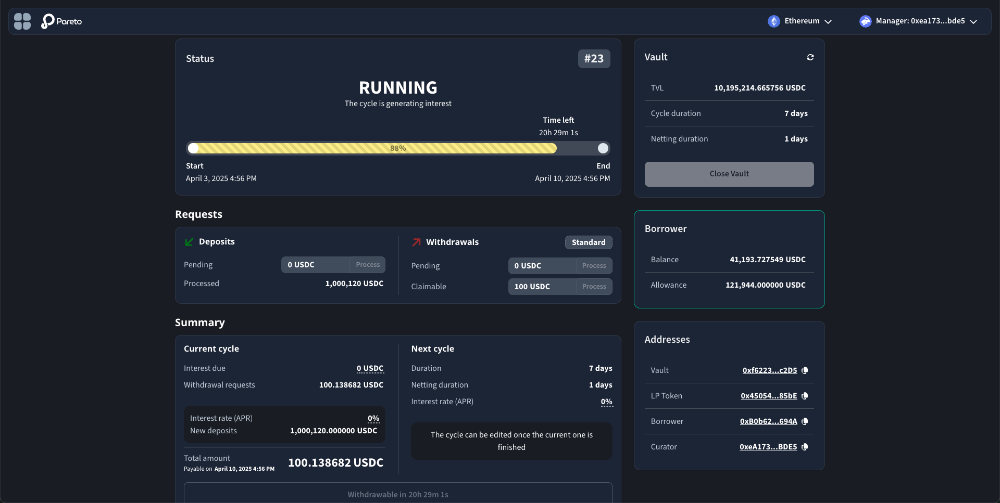

# Borrowers

Borrowers are essential to offer yield strategies to liquidity providers on Pareto.&#x20;

They can leverage proprietary expertise to collect new funds from DeFi users while providing yield strategies that are traditionally limited to TradFi institutions.&#x20;

This concise document aims to present an overview of the borrower's responsibilities and actions.&#x20;

### Key responsibilities

* Interest distribution at every lending cycle end
* Vault parameter adjustment (APR, fees, cycle length)
* Performance and risk reporting to lenders

### Curator app

The Pareto manager app is a specialized front-end interface designed for configuring and managing Credit Vaults. Available at [manager.pareto.credit](https://manager.idle.finance/), this tool provides real-time visibility into fund inflows and outflows. Only whitelisted addresses can interact with the manager app.

From the manager app, curators can easily see the status of the current lending cycle, a countdown to the epoch end, and the borrower's wallet allowance and balance. When a lending cycle ends, they can close it and adjust the length and APR for the following cycle.&#x20;

<figure><figcaption></figcaption></figure>

**Implementation note:** Some actions are not yet implemented in the manager app. For this reason, curators should interact directly with [vault contracts](<README (1).md>) through verified sources such as [Etherscan](https://etherscan.io/) or [Blockscout](https://www.blockscout.com/). Always verify contract addresses before interaction.
