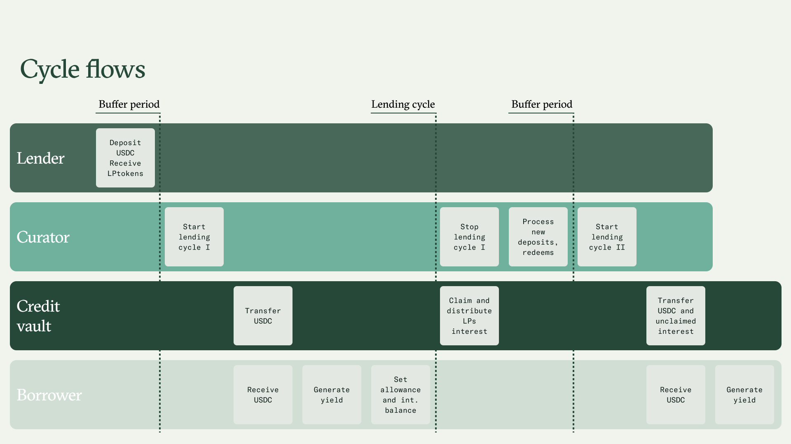
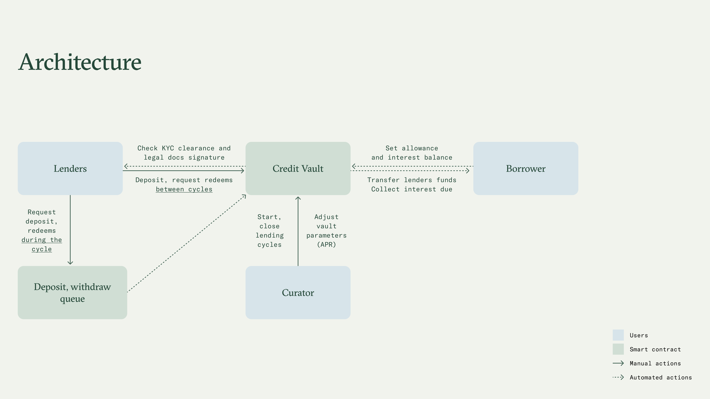

# Credit Vaults

Credit Vaults (CVs) are a suite of smart contracts built to simplify on-chain lending and credit position management for borrowers and lenders. They provide the infrastructure for real-world financing, making it more transparent and efficient.

Assets deposited into a Credit Vault are sent directly to borrower wallets. Only whitelisted borrowers can access loans, and only registered users who complete verification through [Keyring](https://www.keyring.network/) can provide liquidity.

### Features

Credit Vaults introduce several innovations to address inefficiencies in traditional DeFi lending and offer a customized experience for borrowers, curators, and lenders:

* **Diverse IRM**: CVs support both fixed and variable interest rate models. Variable rates are usually benchmarked to third-party data sources, making vault performance easy to monitor.
* **Flexible lending cycles**: Funds are locked for short periods (typically 1 to 4 weeks), called **lending cycles**, allowing high capital utilization and predictable fund management.
* **Regulation compliance**: Native support for privacy-preserving verification and KYC ensures compatibility with regulatory requirements.

### Flow of funds

<figure><figcaption></figcaption></figure>

Credit Vaults operate on a cycle-based system. Funds are borrowed in fixed time intervals known as lending cycles.  The IRM and the duration of the first cycle are defined at vault deployment. Thereafter, at the end of each cycle, the curator can update these parameters.

1. Before the first cycle starts, whitelisted lenders deposit funds.
2. The curator triggers the start of the cycle.
3. The borrower receives the funds directly in their wallet.
4. Interest accrues for lenders throughout the cycle.

The process repeats, with updated terms,  if applicable, for all the following cycles.

#### Redeems

While deposits happen in a single step, withdrawals are a two-step process:



#### Withdraw request

A user requests to redeem funds (principal and/or accrued interest) at the end of Cycle I.



#### Funds claim

At the end of Cycle II, the borrower repays interest and any requested withdrawals. Users who requested to exit can now claim their funds.




**Early exit**

When the interest rate of the next lending cycle is lower than the previous one by 1% or more (or otherwise provided in the Credit Agreement), lenders are entitled to an **early exit** and can redeem funds with a shorter waiting period, i.e., within 72 hours. &#x20;

For example, a lender requests a withdrawal on Jan 31 during Cycle I, where the interest rate is 15%.  If the Cycle II rate drops to 12%, the lender qualifies for an early exit and can claim his funds 72 hours after Cycle II starts (i.e., on Feb 3).


### Architecture

The diagram illustrates the architecture of Credit Vaults

<figure><figcaption></figcaption></figure>

The curator, with the express consent of lenders and the borrower, retains the authority to modify, amend, or adjust CV's parameters as necessary to accommodate requests from lenders or the borrower, or to ensure alignment with the terms and conditions outlined in the MLA.
