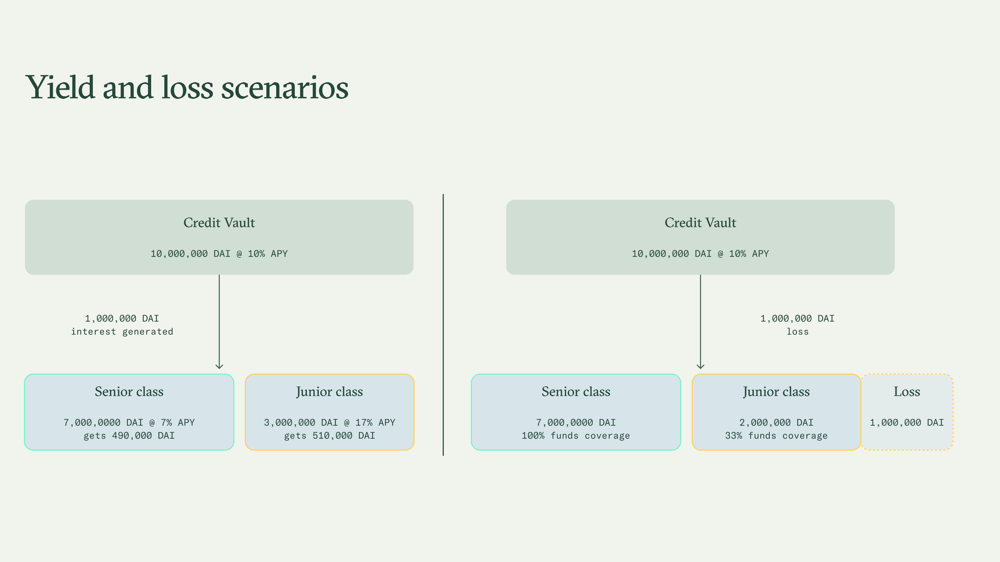

# Tranching

Credit Vaults can **optionally** activate a tranching mechanism to allow users to tailor their lending experience to various risk appetites.

Senior class

This class offers **intrinsic protection on funds**, given by Junior deposits. \
Senior Tranche LPs intrinsically **have a first lien on the underlying assets**, i.e., they are first in line to be repaid in case of default (hack or loss of funds).

Junior class

This class offers a **greater yield** by dragging more exposure to the underlying yield.\
Junior Tranche LPs have a second lien or no lien at all in case of default (hack or loss of funds).

The Junior class is designed to receive a higher share of yield compared to the Senior one, to proportionally compensate for the higher risk taken.

### Yield split

The Tranching feature relies on a unique mechanism that manages the return distribution dynamically conditional to the liquidity deposited on each side (Senior, Junior) of the Credit Vault.

* **Senior class** receives most of the underlying yield when liquidity is low on the Junior side (low coverage), or receives a guaranteed minimum portion of the underlying yield when Junior liquidity is high (high coverage)
* **Junior class** receives outperforming APYs, no matter the Senior class liquidity

Formulae

#### Liquidity ratios 

First, we define the Senior and Junior TVL ratios as

$$\text{TVL ratio}_{Sr} = \frac{\text{Liquidity}_{Senior}}{\text{Liquidity}_{Senior + Junior}}$$

$$\text{TVL ratio}_{Jr} = \frac{\text{Liquidity}_{Junior}}{\text{Liquidity}_{Senior + Junior}}$$

#### Senior and Junior yields 

The Senior return can be calculated as

$$\text{APY}_{Sr} = \text{Base APY} \times \text{Yield share}_{Sr} \qquad \tag{1}$$

where the _Base APY_ is the underlying Tranches yield and the _Yield share_ of the Senior side is a piecewise function conditional to the liquidity on the Senior tranche.

$$\text{Yield share}_{Sr} =      \begin{dcases}         99\% & \text{if } \text{TVL ratio}_{Sr} \geq 99\%  \\         \\          \dfrac{\text{Liquidity}_{Senior}}{\text{Liquidity}_{Senior + Junior}} & \text{if } \text{TVL ratio}_{Sr} > 50\%  \\         \\         50\% & \text{if } \text{TVL ratio}_{Sr} \leq 50\%  \\     \end{dcases}$$

The Junior return can be calculated as

$$\text{APY}_{Jr} = \frac{(\text{Base APY} - \text{APY}_{Sr}) \times \text{TVL ratio}_{Sr}}{\text{TVL ratio}_{Jr}} + \text{Base APY} \qquad \tag{2}$$

When Senior liquidity represents 50-99% of the funds in the Tranche, we use Equation (1) to compute the Yield share of the Senior side.&#x20;

Alternatively, we use some fixed percentages. There are two **hedge cases**:

1. The majority of the vault's liquidity lying on the Senior side (more than 99%)
2. Less than half of the vault's liquidity lying on the Senior side (less than 50%)

$$\text{Yield share}_{Sr} =      \begin{dcases}         99\% & \text{if } \dfrac{\text{Liquidity}_{Senior}}{\text{Liquidity}_{Senior + Junior}} \geq 99\%  \\         \\         50\% & \text{if } \dfrac{\text{Liquidity}_{Senior}}{\text{Liquidity}_{Senior + Junior}} \leq 50\%  \\     \end{dcases}$$

In the first case, we set the Yield share of the Senior class equal to 99% while in the second case, we set it equal to 50%. These two hedge cases link to the principle that

> * **Senior class** receives most of the underlying yield when liquidity is low on the Junior side (low coverage), or receives a guaranteed minimum portion of the underlying yield when Junior liquidity is high (high coverage)
> * **Junior class** receives outperforming APYs, no matter the Senior class liquidity

The _guaranteed minimum portion_, aka the _Yield share_ of the Senior Tranches, has been set to half the _Base APY_ (see HC#2) when the Senior liquidity is smaller than the Junior one.

#### Senior coverage and Junior overperformance 

The formulas of the Senior coverage provided by the Junior counterparty and the Junior boosted yield vs the underlying return are

$$\text{Coverage}_{Sr} = \frac{\text{Liquidity}_{Junior}}{\text{Liquidity}_{Senior}}$$

$$\text{Overperformance}_{Jr} = \frac{\text{APY}_{Jr}}{\text{Base APY}}$$

The Senior coverage should not be confused with the overall Tranche coverage that is computed in proportion to the whole tranche TVL

$$\text{Tranche coverage} = \frac{\text{Liquidity}_{Junior}}{\text{Liquidity}_{Tranche}}$$

### Yield and loss scenarios 

Let's assume to have a Credit Vault generating a 10% yield (base APY), where users deposit 10,000,000 DAI split as follows: 70% on the Senior class, and 30% on the Junior class.

<figure><figcaption></figcaption></figure>

#### **Standard case**

Between 50 and 99% of the total vault's liquidity lying on the Senior side

| Side   | Liquidity     | Expected APY |
| ------ | ------------- | ------------ |
| Senior | 8,000,000 DAI |  8%          |
| Junior | 2,000,000 DAI | 18%          |

The Senior Yield share is equal to 80%. Senior funds coverage is 25% and the Junior overperformance vs base APY is 1.8x. The Tranche coverage is 20%.&#x20;

#### **Hedge case #1**

Majority of the total vault's liquidity lies on the Senior side (≥99%). See the [#formulae](tranching.md#formulae "mention") section.&#x20;

| Side   | Liquidity     | Expected APY |
| ------ | ------------- | ------------ |
| Senior | 9,999,900 DAI | 10%          |
| Junior | 100 DAI       | 20%          |

The Senior Yield share is set to 99% (HC#1). Senior funds coverage is 0% and the Junior overperformance vs base APY is 1.99x. The Tranche coverage is 0% as well.

#### **Hedge case #2**

Less than half of the total vault's liquidity lies on the Senior side (≤50%). See the [#formulae](tranching.md#formulae "mention") section.&#x20;

| Side    | Liquidity     | Expected APY |
| ------- | ------------- | ------------ |
| Senior  | 4,000,000 DAI |  5%          |
| Junior  | 6,000,000 DAI | 13%          |

The Senior Yield share is set to 50% (HC#2). Senior funds coverage is 150% and the Junior overperformance vs base APY is 1.33x. The Tranche coverage is 60%.
