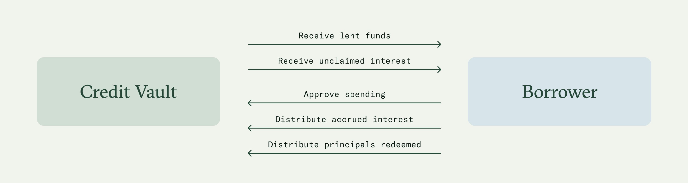

# Borrowers

Borrowers are essential to offer yield strategies to liquidity providers on Pareto. They can leverage proprietary expertise to collect new funds from DeFi users while providing yield strategies that are traditionally limited to TradFi institutions.

### Key responsibilities

<figure><figcaption></figcaption></figure>

* At the start of each cycle (also referred to as "loan cycle" or "loan period" in the Credit Agreement), the borrower automatically receives funds deposited into the CV.
* The borrower’s wallet address is fixed and cannot be modified after smart contract deployment.
* Prior to the end of each cycle, the borrower must ensure to have approved (i.e., set allowance) the CV main contract to automatically settle interest payouts and withdrawal requests.
* The borrower’s wallet must maintain sufficient funds to cover interest and standard withdrawal requests at the end of the cycle and repricing withdrawals once a new lending cycle begins.

### Curator app

The Pareto manager app is a specialized front-end interface designed for configuring and managing Credit Vaults. Available at [manager.pareto.credit](https://manager.idle.finance/), this tool provides real-time visibility into fund inflows and outflows. Only whitelisted addresses can interact with the manager app.

From the manager app, borrowers can easily see the status of the current lending cycle, a countdown to the epoch end, and the wallet allowance and balance.

<figure><figcaption></figcaption></figure>

**Implementation note:** Some actions are not yet implemented in the manager app. For this reason, curators should interact directly with [vault contracts](<../../README (1).md>) through verified sources such as [Etherscan](https://etherscan.io/) or [Blockscout](https://www.blockscout.com/). Always verify contract addresses before interaction.
