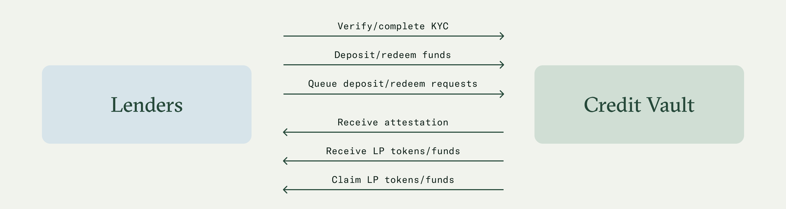

# Lenders

Lenders, such as asset managers, digital asset funds, and other professional investors, are an integral part of the Credit Vault setup and are an essential element of the lending-borrowing equation.&#x20;

### Key responsibilities

<figure><figcaption></figcaption></figure>

* Lenders must be whitelisted and complete the required [verification](verification.md) via Keyring before being allowed to interact with Credit Vaults.
* Lenders must allow Credit Vaults (spending allowance) to execute their deposit/redeem requests.
* Lenders can deposit funds between lending cycles or queue their deposit requests if the cycle is running. Upon deposit, lenders receive the equivalent in LP tokens in their wallet, representing their principal and accrued interest. The Credit Vault LP tokens accumulate interest through their exchange rate; over time, each cvToken becomes convertible into an increasing amount of the deposited funds, which represents the interest accrued according to the Credit Agreement.&#x20;
* Lenders can redeem funds by sending a withdrawal request to claim back funds at the end of the following lending cycle. When completing the withdrawal request, lenders send back an amount of LP tokens proportional to the withdrawal amount. At the end of the next lending cycle, they can complete the process by claiming their funds.&#x20;
  * When the interest rate of the next lending cycle is lower than the previous one by 1% or more (or otherwise provided in the Credit Agreement), lenders are entitled to an **early exit** and can redeem funds with a shorter waiting period, i.e., within 72 hours. &#x20;
