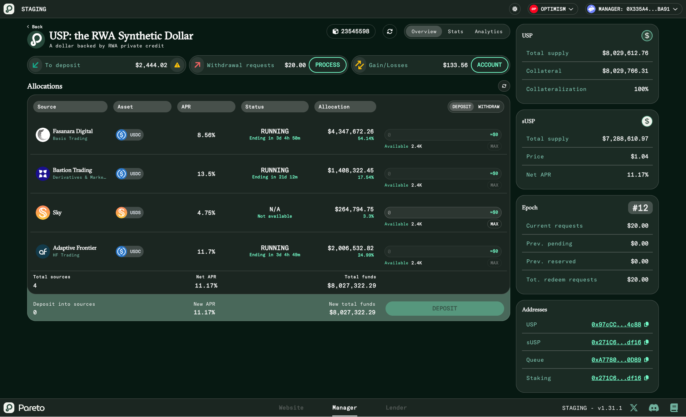
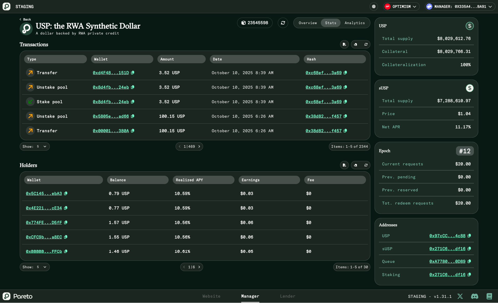
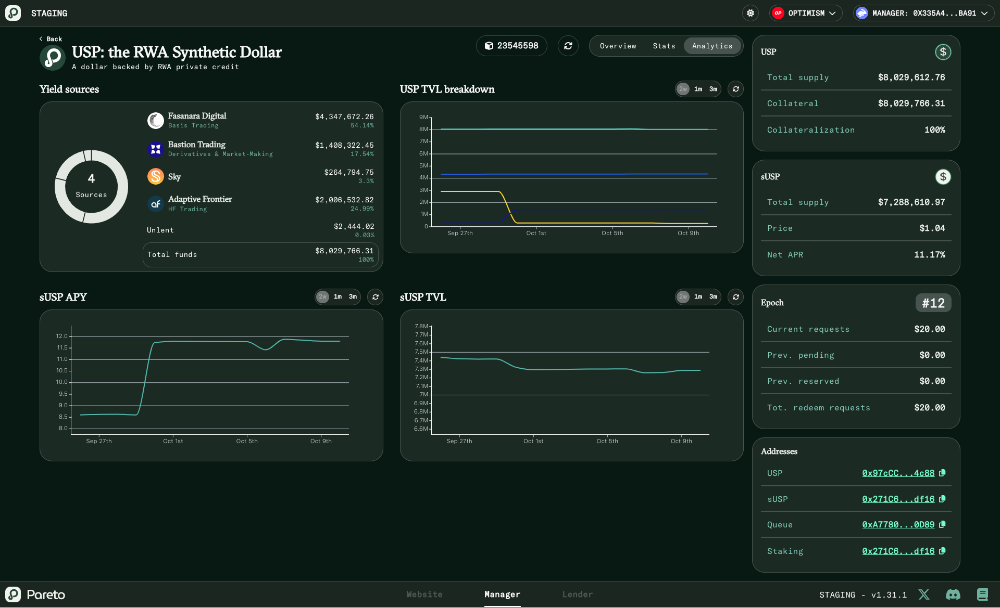

# Curator

This section explains how to operate and manage **USP: The RWA Synthetic Dollar** from the Pareto Manager App. It is designed for **curators** who have been whitelisted by the Pareto team and provides a complete overview of the management interface, available tools, and operational procedures.

***

### Accessing the Manager App

To access the USP management dashboard:

1. Open the Pareto Manager App in your browser:\
   [https://manager.pareto.credit](https://manager.pareto.credit/)
2. Connect using the **wallet address whitelisted** by the Pareto team.

Once connected, you’ll gain access to the full USP dashboard divided into three main tabs:

* **Overview**
* **Stats**
* **Analytics**

<figure><figcaption></figcaption></figure>

***

### Dashboard Overview

#### **Overview Tab**

This section is where the curator can execute all key management operations related to USP, including:

* Managing new **deposits**
* Managing new **withdrawal requests**
* Processing **gain/losses** adjustments

At the top of the page, three interactive **cards** summarize current actions:

* **To Deposit** → Funds available to be allocated into yield sources.
* **Withdrawal Requests** → Pending withdrawals to be processed.
* **Gain/Losses** → Adjustments to be applied periodically.

Each card displays the total amount involved and highlights whether an action is required.\

<figure><figcaption></figcaption></figure>

***

#### **Stats Tab**

The **Stats** section provides a transparent view of the system’s activity and token distribution.

It includes:

* **Transactions table** → Displays every deposit, withdrawal, and staking event.
* **Holders table** → Shows all current wallets holding USP or sUSP, their realized APY, and total earnings.

<figure><figcaption></figcaption></figure>

***

#### **Analytics Tab**

The **Analytics** section offers a visual overview of USP performance and distribution.\
It includes several charts:

* **Yield Sources** → Allocation breakdown among all active credit vaults and liquidity pools.
* **USP TVL Breakdown** → Historical trend of USP total value locked.
* **sUSP TVL** → Tracks the total amount of staked USP over time.
* **sUSP APY** → Displays the real-time and historical staking APY evolution.\

<figure><figcaption></figcaption></figure>

***

### Sidebar Overview

The right sidebar remains visible across all tabs and provides the curator with essential, real-time data:

* **USP Metrics** → Total supply, collateral, and collateralization ratio.
* **sUSP Metrics** → Total supply, staking price, and net APY.
* **Epoch Data** → Current epoch number, pending and processed requests, and total redemptions.
* **Contract Addresses** → Direct access to the deployed smart contract addresses for transparency and on-chain verification.

***

### Operations in the Overview Tab

#### 1. Managing New Deposits

The **To Deposit** card indicates the total funds available for allocation into yield sources.\
If the amount displayed is greater than zero, the curator can allocate the funds directly through the **Allocations table** below.

**Deposit rules:**

* Deposits into **USDS** can be made **at any time**.
* Deposits into **Credit Vaults** can be made **only during the NETTING state**.

***

#### 2. Managing Withdrawal Requests

The **Withdrawal Requests** card shows the total amount currently requested for withdrawal from USP.\
If this amount is greater than zero, the curator can initiate the process using the **Process** button.

**When in withdrawal mode:**

* Funds can be withdrawn **directly from USDS**.
* Withdrawal requests can be submitted to **Credit Vaults** that are currently in the **NETTING** state.

Once requests are submitted, their processing status will be visible in the **Allocations table**.\
After the vaults process them, each request must be **claimed** to complete the redemption and satisfy withdrawal requirements.

> ⚠️ Once all requested funds are claimed and available, **no further withdrawals** are required.

***

#### 3. Managing Account Gain/Losses

The **Gain/Losses** card shows the profit or loss adjustments to be processed.\
This operation is typically performed **once per week**, after all the credit vault weekly cycles have concluded.

***

#### 4. Rebalancing Funds

In addition to the three main actions, the curator can **rebalance funds** between yield sources whenever necessary.

At the bottom of the **Allocations table**, a summary preview shows:

* The **new sUSP APR** that will result from the rebalancing.
* The **new total funds** distributed across all yield sources.

This feature helps maintain optimal performance and efficient fund allocation.

***

### Summary

| Function      | Description                                                                   |
| ------------- | ----------------------------------------------------------------------------- |
| **Overview**  | Main management section for deposits, withdrawals, and gain/loss adjustments. |
| **Stats**     | Displays all USP/sUSP transactions and holder data.                           |
| **Analytics** | Offers visual insights into yield allocations, TVL, and performance metrics.  |
| **Sidebar**   | Provides real-time metrics, epoch data, and contract addresses.               |

***

#### Final Notes

* All operations must be performed using a **whitelisted curator wallet**.
* Credit vault actions depend on their **state (RUNNING / NETTING)**.
* Always verify epoch status and available balances before executing transactions.

The USP Manager Dashboard is designed to offer **complete operational transparency** and **fine-grained control** over Pareto’s synthetic dollar ecosystem.
