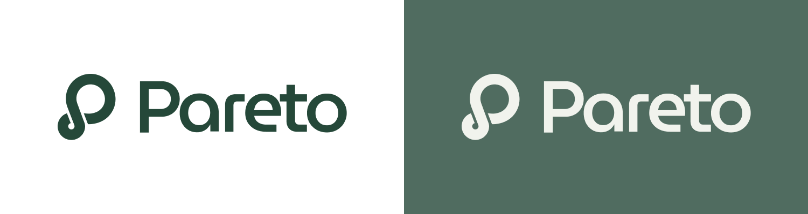

# Media kit

Pareto brand guidelines provide logos, icons, and descriptions about the brand.

## About Pareto

Tagline

A private credit marketplace for institutional borrowers and lenders.

Short description

Pareto is a private credit marketplace that connects institutional lenders and borrowers, providing scalable, yield-generating opportunities.

Boilerplate description

Pareto is a private credit marketplace that connects institutional lenders and borrowers, providing scalable, yield-generating opportunities and enabling institutional capital to move onchain.

Tailored for asset managers, digital asset funds, fintechs, and other professional investors, Pareto offers seamless access to regulatory-compliant alternative credit products, alongside whitelabel infrastructure that enables partners to launch branded credit products onchain.

## About USP

Tagline

USP is a credit-backed synthetic dollar.

Short description

USP is a synthetic dollar protocol backed by real-world institutional-grade private credit, alongside a globally accessible savings asset, sUSP.

## Brand assets

### Logos

Pareto's logo visually represents the core principles of liquidity flow, financial connectivity, and cyclical capital movement, emphasizing the Pareto 80/20 principle.

<figure><figcaption></figcaption></figure>



### Typography

Primary font: [Inter](https://fonts.google.com/specimen/Inter)

Secondary font: [GT America Mono](https://www.grillitype.com/typeface/gt-america)

### Colors

#### Primary colors

<table data-view="cards"><thead><tr><th></th><th data-hidden data-card-cover data-type="files"></th></tr></thead><tbody><tr><td>#254839</td><td><a href="../.gitbook/assets/Docs_colours_green.png">Docs_colours_green.png</a></td></tr><tr><td>#081912</td><td><a href="../.gitbook/assets/Docs_colours_black.png">Docs_colours_black.png</a></td></tr><tr><td>#E3E8E2</td><td><a href="../.gitbook/assets/Docs_colours_beije.png">Docs_colours_beije.png</a></td></tr></tbody></table>

#### Secondary colors

<table data-view="cards"><thead><tr><th></th><th data-hidden data-card-cover data-type="files"></th></tr></thead><tbody><tr><td>#70B19E</td><td><a href="../.gitbook/assets/Docs_colours_green_v2.png">Docs_colours_green_v2.png</a></td></tr><tr><td>#48685A</td><td><a href="../.gitbook/assets/Docs_colours_green_v3.png">Docs_colours_green_v3.png</a></td></tr><tr><td>#F9F9F9</td><td><a href="../.gitbook/assets/F9F9F9.png">F9F9F9.png</a></td></tr></tbody></table>
