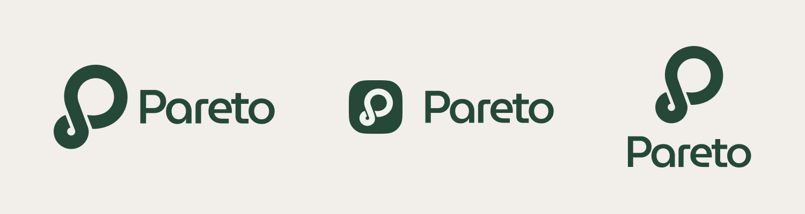

# Media kit

Pareto brand guidelines provide logos, icons, descriptions about the brand.

## About Pareto

Tagline

[Pareto](https://pareto.credit/) is an on-chain private credit marketplace.&#x20;

Short description

Pareto is a private credit marketplace that connects institutional lenders and borrowers, offering scalable yield opportunities to bridge institutional capital on-chain.

Boilerplate description

Pareto is a private credit marketplace that connects institutional lenders and borrowers, offering scalable yield opportunities to bridge institutional capital on-chain.

Designed for asset managers, digital asset funds, and institutional investors, our comprehensive infrastructure provides seamless access to regulatory-compliant alternative credit solutions. Built on transparency, scalability, and automation, Pareto’s Credit Vaults eliminate bureaucratic friction, reduce operational costs, and enhance capital efficiency.

As the financial landscape evolves, Pareto aims to set a new standard for institutional credit with fully automated, data-driven lending solutions.

## Brand assets

### Logos

Pareto's logo visually represents the core principles of liquidity flow, financial connectivity, and cyclical capital movement, emphasizing the Pareto 80/20 principle.

<figure><figcaption></figcaption></figure>



### Colours

#### Primary colours

<table data-view="cards"><thead><tr><th></th><th data-hidden data-card-cover data-type="files"></th></tr></thead><tbody><tr><td>#254839</td><td><a href="../.gitbook/assets/Docs_colours_green.png">Docs_colours_green.png</a></td></tr><tr><td>#081912</td><td><a href="../.gitbook/assets/Docs_colours_black.png">Docs_colours_black.png</a></td></tr><tr><td>#E3E8E2</td><td><a href="../.gitbook/assets/Docs_colours_beije.png">Docs_colours_beije.png</a></td></tr></tbody></table>

#### Secondary colours

<table data-view="cards"><thead><tr><th></th><th data-hidden data-card-cover data-type="files"></th></tr></thead><tbody><tr><td>#70B19E</td><td><a href="../.gitbook/assets/Docs_colours_green_v2.png">Docs_colours_green_v2.png</a></td></tr><tr><td>#48685A</td><td><a href="../.gitbook/assets/Docs_colours_green_v3.png">Docs_colours_green_v3.png</a></td></tr><tr><td>#D7E4EA</td><td><a href="../.gitbook/assets/Docs_colours_light_blue.png">Docs_colours_light_blue.png</a></td></tr></tbody></table>

### Typography

Primary font: [GT Sectra](https://www.grillitype.com/typeface/gt-sectra)

Secondary font: [GT America Mono](https://www.grillitype.com/typeface/gt-america)
